# Contract Review AI

Contract Review AI 是一个面向中文合同审查场景的 Web 应用。系统支持合同上传、AI 预分析、审查点配置、OnlyOffice 在线预览编辑、知识库检索、裁判文书增强、智能问答和受控联网搜索。

## 功能

- 合同上传与预分析：上传 DOCX/PDF，自动识别合同类型、主体、审查范围。
- 合同审查结果页：输出风险点、修改建议、相关法条、裁判文书和审查理由。
- OnlyOffice 联动：在文档中定位条款、添加批注、一键采纳建议，采纳后的建议文本会高亮并保留原文提示。
- 知识库管理：支持法律法规、裁判文书、审查规则的导入、检索、删除和模板下载。
- 默认知识库初始化：默认初始化 `backend/data/laws/社会法`、`backend/data/laws/民法典`，以及 `backend/data/candidate_55192` 中按文件名排序的前 10 个裁判文书 JSON。
- 智能问答：使用 SSE 流式输出，携带会话历史；后端先检索知识库，必要时执行受限公网搜索。
- 数据存储：业务数据使用 PostgreSQL；文件只保存路径和元数据，不存入数据库；向量数据优先使用 Milvus，也可回退到 PostgreSQL。
- backend/data/ 下法律法规和裁判文书案例只有部分，更多数据请 clone https://github.com/xiaodingfeng/contract-review-laws.git 
- offer-demo.docx为示例合同文档

## Demo 图

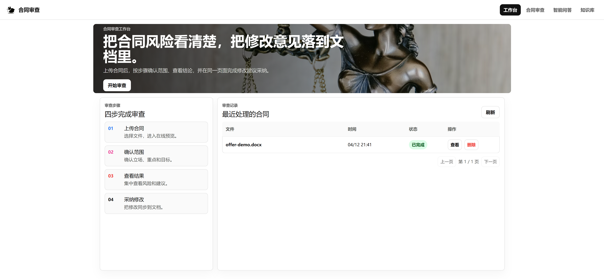

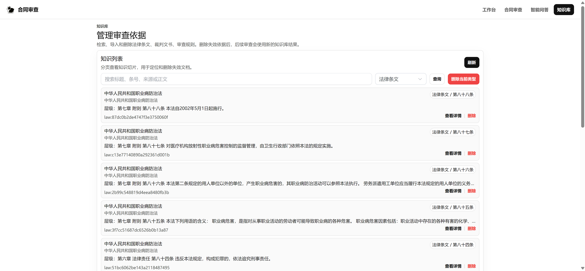

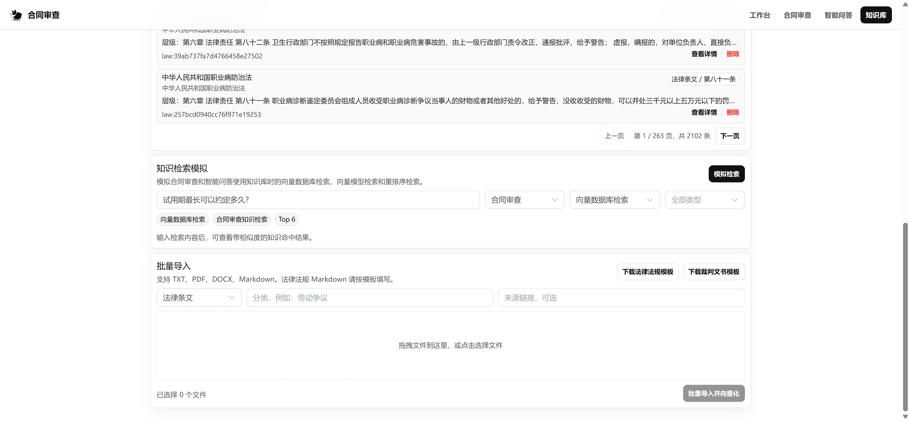

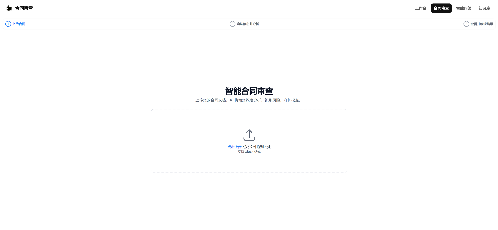

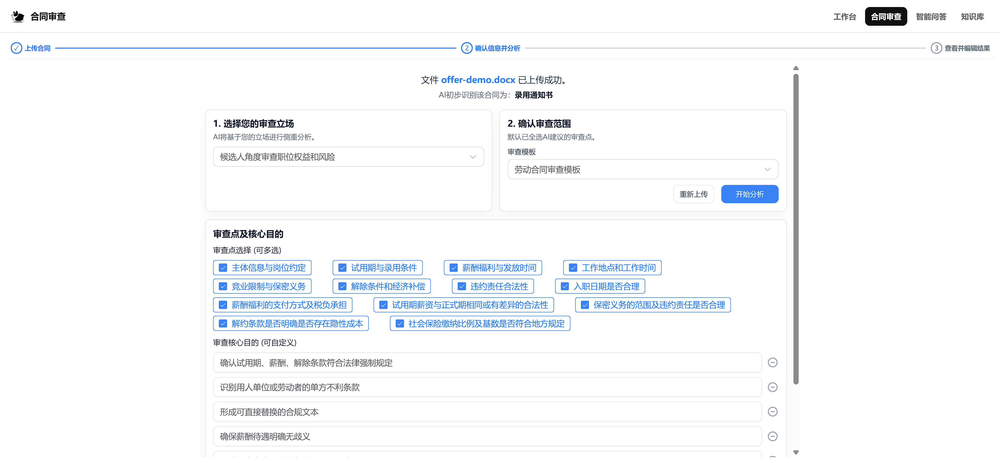

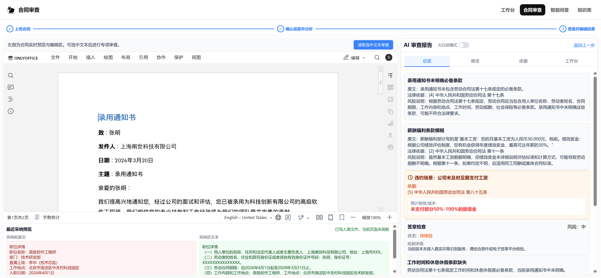

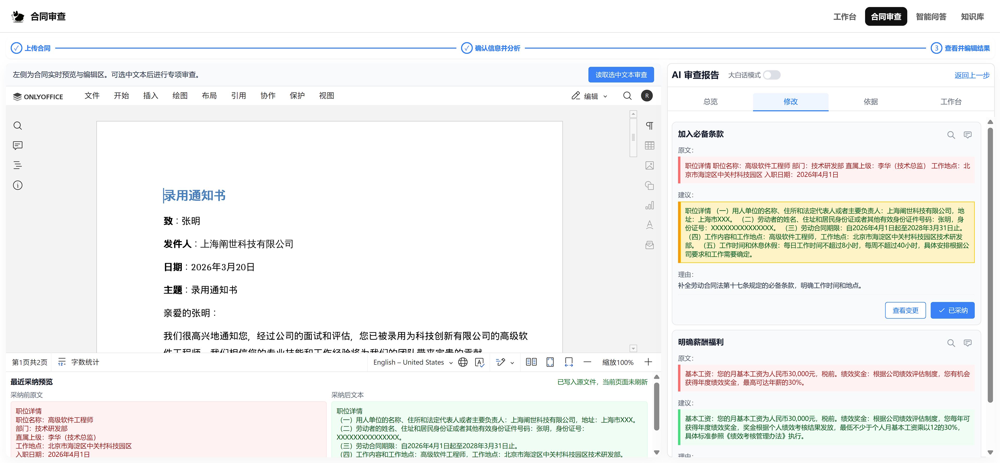

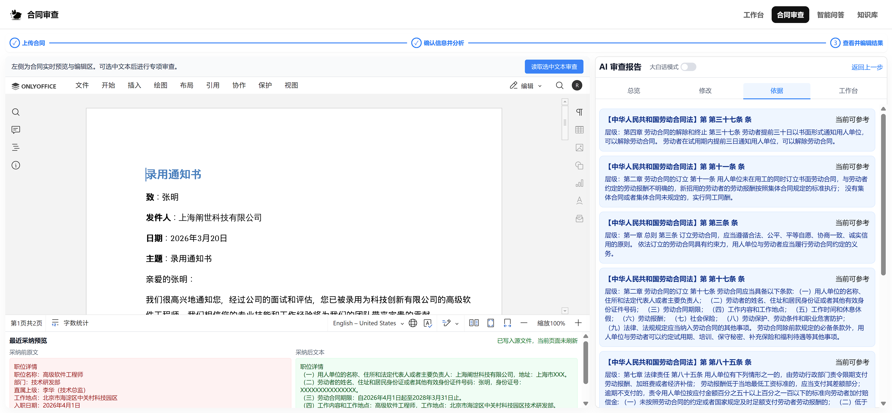

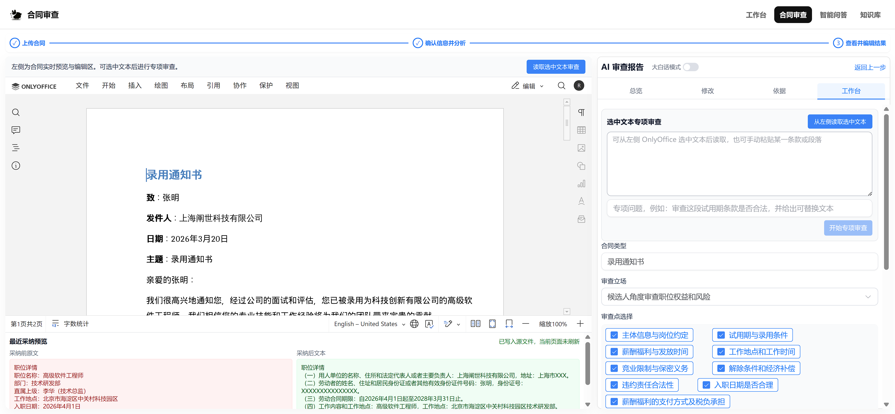

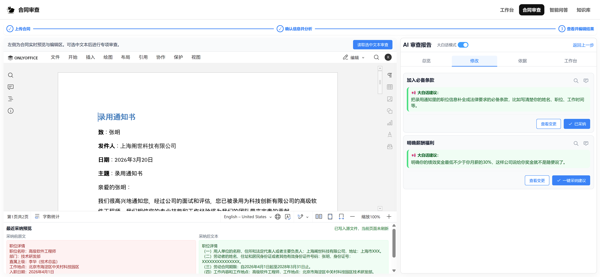

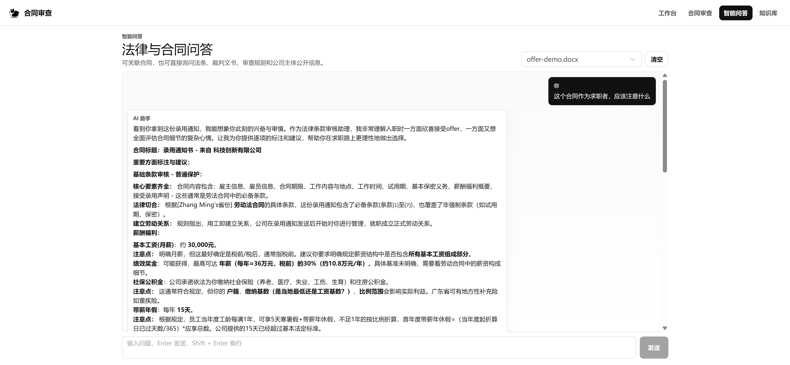

## 技术栈

- 前端：Vue 3、Vite、Element Plus、Tailwind CSS、OnlyOffice Document Editor
- 后端：Node.js、Express、Knex、PostgreSQL、Socket.IO
- AI：OpenAI 标准 Chat Completions 兼容接口
- 知识库：Milvus、Embedding、Rerank、法律 Markdown 解析、裁判文书 JSON 解析
- 基础服务：Docker Compose、PostgreSQL、Milvus、MinIO、etcd、OnlyOffice

## 目录结构

```text
backend/
  data/                  # 内置法律、裁判文书、模板和审查模板
  routes/                # 合同、问答、知识库、用户等接口
  services/              # 向量库、embedding、联网搜索、解析器
  uploads/               # 本地上传文件目录，已忽略
frontend/
  src/                   # Vue 应用源码
  dist/                  # 构建产物，已忽略
data/
  postgres/              # Docker PostgreSQL 映射目录，已忽略
  milvus/                # Docker Milvus/MinIO/etcd 映射目录，已忽略
  onlyoffice/            # Docker OnlyOffice 映射目录，已忽略
docker-compose.yml
```

## 环境要求

- Node.js 20+
- npm 10+
- Docker Desktop 或 Docker Engine
- 可访问的 OpenAI 兼容 LLM 和 Embedding 服务

## 快速开始

1. 安装依赖：

```bash
cd backend && npm install
cd ../frontend && npm install
```

2. 准备环境变量：

```bash
copy backend\.env.example backend\.env
copy frontend\.env.example frontend\.env.development
```

在 `backend/.env` 中至少配置：

- `LLM_API_KEY`
- `EMBEDDING_API_KEY`
- `RERANK_API_KEY`，如不使用重排可留空
- `ONLYOFFICE_JWT_SECRET`
- PostgreSQL、Milvus、OnlyOffice 地址

3. 启动基础服务：

```bash
docker compose up -d
```

4. 启动后端：

```bash
cd backend
npm run dev
```

后端启动时会检查数据库表，并按环境变量初始化知识库，可能需要一到两分钟初始化向量库。

5. 启动前端：

```bash
cd frontend
npm run dev
```

默认访问地址为 `http://localhost:8080`。

## 环境变量

后端示例见 `backend/.env.example`，前端示例见 `frontend/.env.example`。示例文件包含中文注释和安全占位值。

常用后端变量：

- `LLM_BASE_URL`、`LLM_API_KEY`、`LLM_MODEL`：OpenAI 标准 Chat Completions 兼容聊天模型
- `EMBEDDING_BASE_URL`、`EMBEDDING_API_KEY`、`EMBEDDING_MODEL`、`EMBEDDING_DIM`：向量化模型
- `RERANK_BASE_URL`、`RERANK_API_KEY`、`RERANK_MODEL`：重排模型
- `DATABASE_URL` 或 `POSTGRES_*`：PostgreSQL 连接
- `VECTOR_STORE`、`MILVUS_*`：向量库配置
- `ONLYOFFICE_URL`、`ONLYOFFICE_JWT_SECRET`、`APP_HOST`、`BACKEND_URL_FOR_DOCKER`：OnlyOffice 联动
- `KNOWLEDGE_SEED_TYPES`、`LAW_SEED_DIRS`、`CASE_SEED_DIR`、`CASE_SEED_LIMIT`：知识库初始化范围

常用前端变量：

- `VITE_APP_BACKEND_API_URL`：后端服务地址，不带 `/api`
- `VITE_APP_ONLYOFFICE_URL`：浏览器可访问的 OnlyOffice 地址

## 知识库初始化

默认配置：

```env
KNOWLEDGE_SEED_TYPES=law,case
LAW_SEED_DIRS=社会法,民法典
CASE_SEED_DIR=data/candidate_55192
CASE_SEED_LIMIT=10
```

只初始化法律：

```env
KNOWLEDGE_SEED_TYPES=law
```

只初始化裁判文书：

```env
KNOWLEDGE_SEED_TYPES=case
```

初始化其他法律目录：

```env
LAW_SEED_DIRS=经济法,行政法
```

## 构建

```bash
cd frontend
npm run build
```

当前构建使用 Vite ESM 配置、路由懒加载和 Rollup manual chunks。主要页面和第三方依赖会拆成独立 chunk，避免主包过大。

## 安全说明

- 不要提交 `.env`、真实密钥、数据库口令、上传文件、构建产物和 Docker 映射目录。
- 智能问答的联网搜索由后端受控触发，只用于公开信息检索；涉及隐私、凭证、绕过、攻击等请求会跳过搜索或拒绝处理。
- 联网搜索结果只作为线索，正式主体信息仍应以国家企业信用信息公示系统、监管机关、法院官网等正式渠道核验。
- 数据库只保存文件路径、文档 key、审查结果和元数据，不保存文件二进制内容。

## License

MIT
