# Contract Review AI

> 基于 AI 的中文合同审查与知识库增强平台，支持合同风险分析、OnlyOffice 在线审阅、法律知识检索与智能问答。

## ✨ Features

* 📄 合同上传与 AI 预分析

  * 支持 DOCX / PDF 上传
  * 自动识别合同类型、主体信息与审查范围

* ⚖️ 合同风险审查

  * 输出风险点、修改建议、相关法条与审查理由
  * 支持关联裁判文书增强分析

* 📝 OnlyOffice 在线协同编辑

  * 文档内精准定位条款
  * 添加批注与修改建议
  * 一键采纳建议并高亮变更内容

* 📚 法律知识库

  * 支持法律法规、裁判文书、审查规则导入
  * 支持向量检索、删除与模板下载

* 🤖 智能问答

  * SSE 流式输出
  * 携带上下文会话历史
  * 支持知识库检索 + 受控联网搜索

* 🧠 向量检索与 AI 能力

  * Embedding / Rerank
  * Milvus 向量数据库
  * OpenAI Compatible API

* 🐳 Docker 一键部署

  * PostgreSQL
  * Milvus
  * MinIO
  * OnlyOffice

---

## 🖼️ Demo

| 首页             | 合同分析           |
| -------------- | -------------- |
| 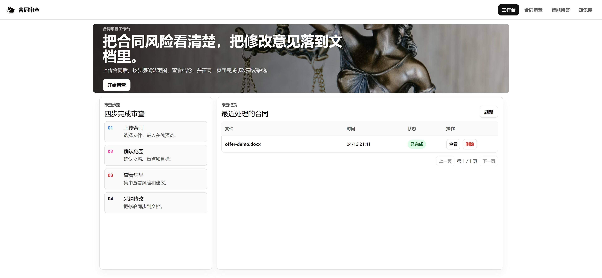 | 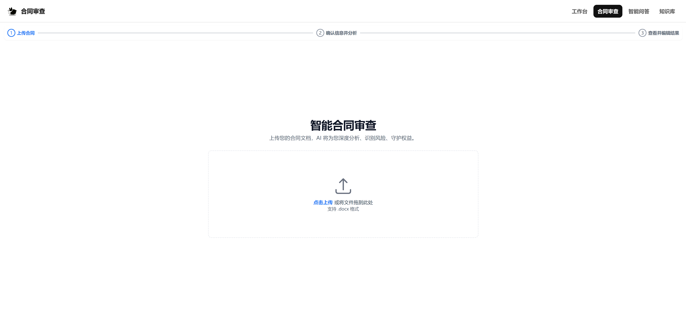 |

| 风险审查           | 修改建议           |
| -------------- | -------------- |
| 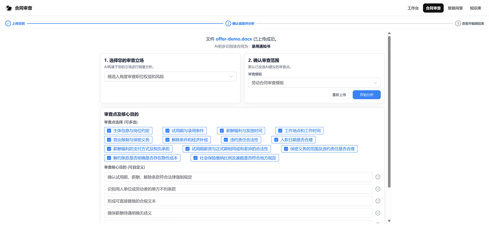 | 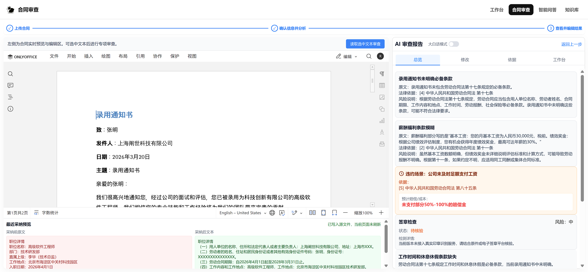 |

| 知识库            | 智能问答           |
| -------------- | -------------- |
| 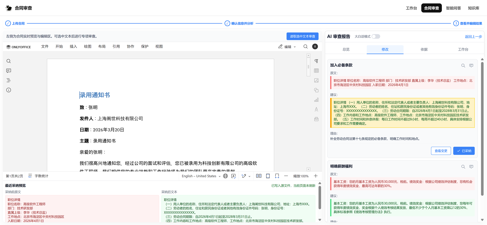 | 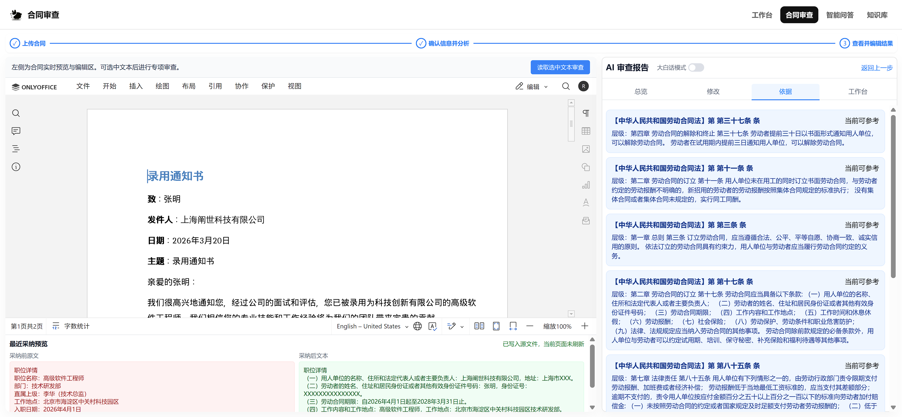 |

更多演示图：

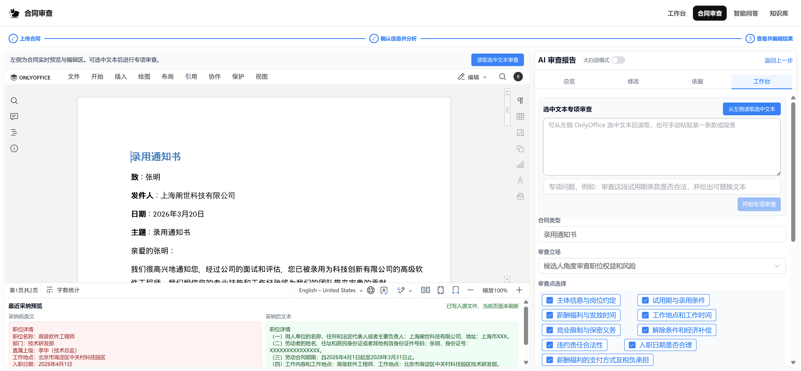

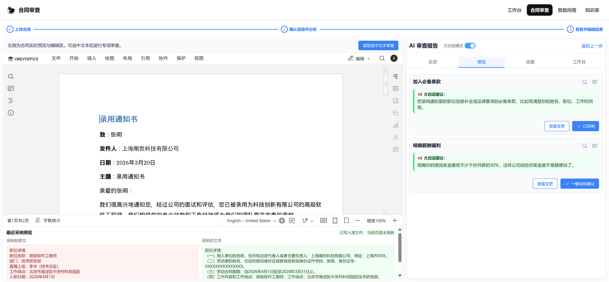

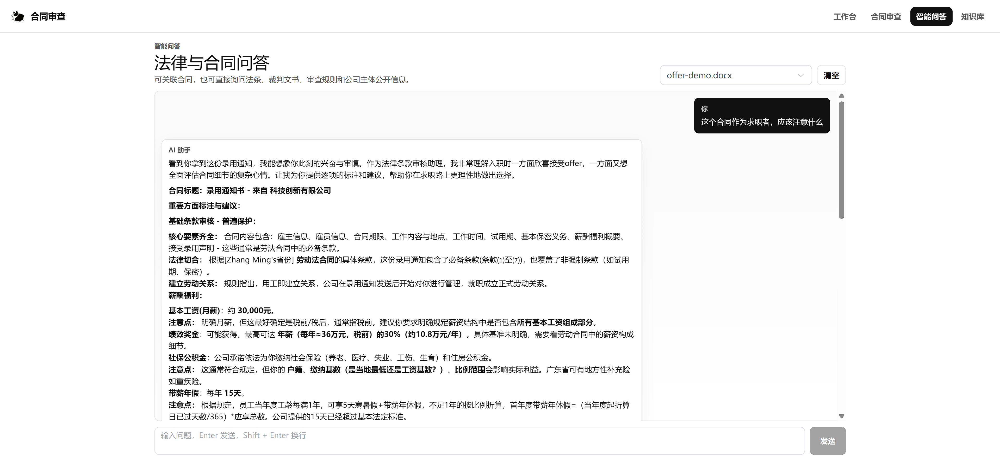

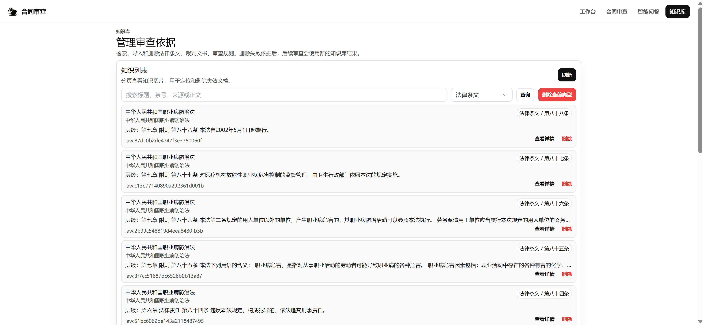

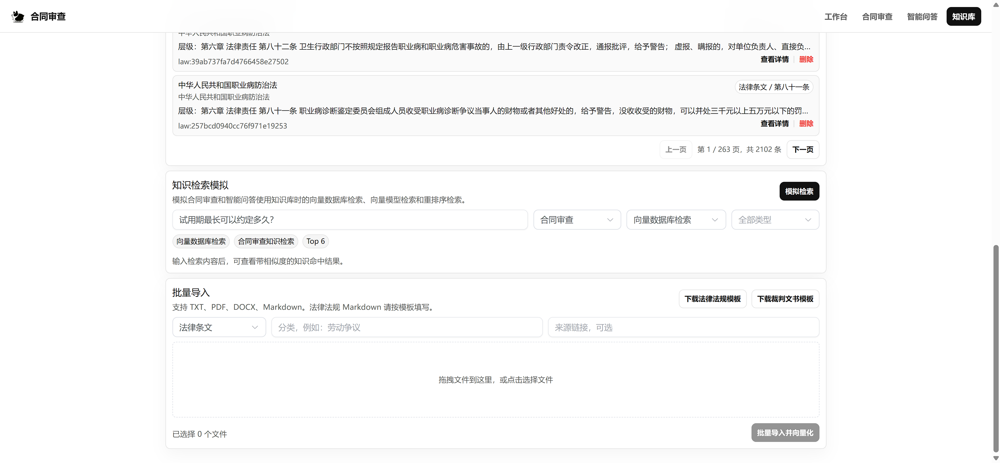

---

## 🏗️ Tech Stack

### Frontend

* Vue 3
* Vite
* Element Plus
* Tailwind CSS
* OnlyOffice Document Editor

### Backend

* Node.js
* Express
* Knex
* PostgreSQL
* Socket.IO

### AI / RAG

* OpenAI Compatible Chat API
* Embedding
* Rerank
* Milvus
* 法律 Markdown 解析
* 裁判文书 JSON 解析

### Infrastructure

* Docker Compose
* PostgreSQL
* Milvus
* MinIO
* etcd
* OnlyOffice

---

## 📁 Project Structure

```text
.
├── backend/
│   ├── data/              # 法律法规、裁判文书、模板
│   ├── routes/            # API 路由
│   ├── services/          # AI / 向量库 / 检索服务
│   └── uploads/           # 上传目录（已忽略）
│
├── frontend/
│   ├── src/               # Vue 源码
│   └── dist/              # 构建产物（已忽略）
│
├── data/
│   ├── postgres/          # PostgreSQL 数据目录
│   ├── milvus/            # Milvus / MinIO / etcd
│   └── onlyoffice/        # OnlyOffice 数据目录
│
├── docker-compose.yml
└── README.md
```

---

## 🚀 Quick Start

### 1. Clone Repository

```bash
git clone https://github.com/xiaodingfeng/contract-review-v2

cd contract-review-v2
```

---

### 2. Install Dependencies

```bash
# backend
cd backend
npm install

# frontend
cd ../frontend
npm install
```

---

### 3. Configure Environment Variables

```bash
# backend
copy .env.example .env

# frontend
copy .env.example .env.development
```

### Backend Required Variables

```env
LLM_API_KEY=
EMBEDDING_API_KEY=
ONLYOFFICE_JWT_SECRET=
```

同时需要配置：

* PostgreSQL
* Milvus
* OnlyOffice

---

### 4. Start Infrastructure Services

```bash
docker compose up -d
```

---

### 5. Start Backend

```bash
cd backend

npm run dev
```

首次启动会：

* 初始化数据库
* 初始化知识库
* 构建向量索引

可能需要 1~2 分钟。

---

### 6. Start Frontend

```bash
cd frontend

npm run dev
```

默认访问地址：

```text
http://localhost:8080
```

---

## ⚙️ Environment Variables

### Backend

| Variable                | Description           |
| ----------------------- | --------------------- |
| `LLM_BASE_URL`          | LLM API 地址            |
| `LLM_API_KEY`           | LLM API Key           |
| `LLM_MODEL`             | 聊天模型                  |
| `EMBEDDING_BASE_URL`    | Embedding API         |
| `EMBEDDING_MODEL`       | 向量模型                  |
| `RERANK_MODEL`          | 重排模型                  |
| `DATABASE_URL`          | PostgreSQL 连接         |
| `VECTOR_STORE`          | 向量数据库类型               |
| `MILVUS_*`              | Milvus 配置             |
| `ONLYOFFICE_URL`        | OnlyOffice 地址         |
| `ONLYOFFICE_JWT_SECRET` | OnlyOffice JWT Secret |

### Frontend

| Variable                   | Description   |
| -------------------------- | ------------- |
| `VITE_APP_BACKEND_API_URL` | 后端 API 地址     |
| `VITE_APP_ONLYOFFICE_URL`  | OnlyOffice 地址 |

---

## 📚 Knowledge Base Initialization

默认配置：

```env
KNOWLEDGE_SEED_TYPES=law,case
LAW_SEED_DIRS=社会法,民法典
CASE_SEED_DIR=data/candidate_55192
CASE_SEED_LIMIT=10
```

### 仅初始化法律法规

```env
KNOWLEDGE_SEED_TYPES=law
```

### 仅初始化裁判文书

```env
KNOWLEDGE_SEED_TYPES=case
```

### 初始化指定法律目录

```env
LAW_SEED_DIRS=经济法,行政法
```

---

## 🧩 Built-in Dataset

默认仓库仅包含部分法律法规与裁判文书数据。

完整数据请额外拉取：

```bash
git clone https://github.com/xiaodingfeng/contract-review-laws.git
```

示例合同文件：

```text
offer-demo.docx
```

---

## 🛠️ Build

```bash
cd frontend

npm run build
```

当前构建配置：

* Vite ESM
* 路由懒加载
* Rollup Manual Chunks
* 第三方依赖拆包优化

---

## 🔐 Security Notes

* 不要提交：

  * `.env`
  * API Key
  * 数据库密码
  * 上传文件
  * Docker 数据目录

* 联网搜索：

  * 仅用于公开信息检索
  * 涉及敏感内容时自动拒绝

* 数据库存储：

  * 仅保存路径与元数据
  * 不保存文件二进制内容

---

## 📌 Roadmap

* [ ] 多租户支持
* [ ] OCR 合同解析
* [ ] Office 在线多人协作
* [ ] 审查规则可视化编排
* [ ] MCP / Agent 插件体系
* [ ] LangGraph 工作流支持

---

## 📄 License

MIT

---

## ⭐ Acknowledgements

* OnlyOffice
* Milvus
* OpenAI
* Vue.js
* PostgreSQL
* Element Plus
